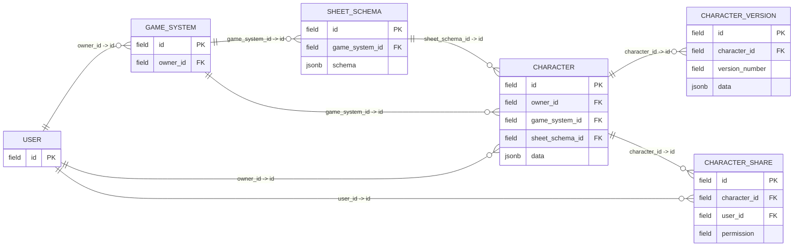

# ERD DiceBound

Документ содержит принципиальную ERD актуальной модели данных MVP DiceBound.
Диаграмма показывает основные таблицы, PK, FK и cardinality между сущностями.

## ERD



В диаграмме `field` используется как нейтральное обозначение поля.
Фактические SQL-типы полей не являются частью данной принципиальной ERD.

## Сущности и ключи

| Таблица | PK | FK |
|---|---|---|
| `User` | `id` | — |
| `GameSystem` | `id` | `owner_id -> User.id` |
| `SheetSchema` | `id` | `game_system_id -> GameSystem.id` |
| `Character` | `id` | `owner_id -> User.id`, `game_system_id -> GameSystem.id`, `sheet_schema_id -> SheetSchema.id` |
| `CharacterVersion` | `id` | `character_id -> Character.id` |
| `CharacterShare` | `id` | `character_id -> Character.id`, `user_id -> User.id` |

## Связи и cardinality

| Связь | Cardinality | FK |
|---|---|---|
| `User -> GameSystem` | `1:N` | `game_systems.owner_id -> users.id` |
| `User -> Character` | `1:N` | `characters.owner_id -> users.id` |
| `User -> CharacterShare` | `1:N` | `character_shares.user_id -> users.id` |
| `GameSystem -> SheetSchema` | `1:N` | `sheet_schemas.game_system_id -> game_systems.id` |
| `GameSystem -> Character` | `1:N` | `characters.game_system_id -> game_systems.id` |
| `SheetSchema -> Character` | `1:N` | `characters.sheet_schema_id -> sheet_schemas.id` |
| `Character -> CharacterVersion` | `1:N` | `character_versions.character_id -> characters.id` |
| `Character -> CharacterShare` | `1:N` | `character_shares.character_id -> characters.id` |

## Связь Character

`Character` связан с тремя основными сущностями MVP.

`Character.owner_id` определяет владельца персонажа через `User.id`.
`Character.game_system_id` определяет используемую игровую систему через `GameSystem.id`.
`Character.sheet_schema_id` определяет конкретную структуру листа через `SheetSchema.id`.

Таким образом, основная цепочка модели MVP имеет вид:

```text
User
  |
  +---- GameSystem
  |        |
  |        +---- SheetSchema
  |                 |
  +-----------------+---- Character
                              |
                              +---- CharacterVersion
                              |
                              +---- CharacterShare
```

`Character` напрямую хранит ссылки на `User`, `GameSystem` и `SheetSchema`.
Связь `GameSystem -> SheetSchema -> Character` не заменяет прямую связь `Character -> GameSystem`.

## CharacterVersion

`CharacterVersion` хранит версии данных конкретного `Character`.
Каждая запись `CharacterVersion` связана с одним `Character` через `character_id`.
Поле `data` содержит полный снимок данных персонажа.

В MVP новая версия создаётся при логическом сохранении персонажа.
Восстановление предыдущей версии не создаёт новую запись `CharacterVersion`.
При восстановлении удаляются версии, созданные после выбранной версии.

## CharacterShare

`CharacterShare` хранит связь персонажа с пользователем, которому предоставлен доступ.
Запись связана с `Character` через `character_id` и с `User` через `user_id`.
Для пары `character_id` и `user_id` действует ограничение уникальности.

`VIEW` предоставляет доступ к просмотру исходного `Character`.
`EDIT` в MVP не предоставляет право редактировать исходный `Character`.
При `EDIT` для получателя создаётся отдельная копия `Character` со своей историей версий.

## SheetSchema

`SheetSchema` определяет структуру листа персонажа для конкретного `GameSystem`.
Поле `schema` хранит описание структуры в `JSONB`.
`Character` ссылается на конкретный `SheetSchema` через `sheet_schema_id`.

Используемый `SheetSchema` считается неизменяемым в рамках MVP.
При несовместимом изменении структуры создаётся новый `SheetSchema`.

## MVP-ограничения

`SystemVersion` не входит в актуальную ERD MVP.
Связь `GameSystem -> SystemVersion` отсутствует.
`CharacterVersion` не содержит ссылки на `SystemVersion`.
`CharacterVersion` не содержит отдельного автора ревизии.

Механизм миграции существующих персонажей между версиями структуры листа не входит в MVP.
Полная модель `SystemVersion` и миграция данных относятся к post-MVP.

## Связанные документы

- [Сущности модели данных](entities.md)
- [Связи модели данных](relationships.md)
- [Стратегия хранения данных](storage-strategy.md)
- [Версионирование персонажей](character-versioning.md)
