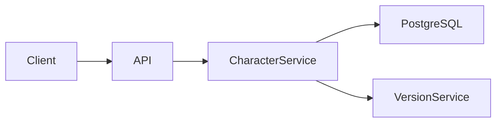

# DiceBound Documentation Style Guide

Этот документ определяет единый стиль документации DiceBound.

Правила распространяются на README, технические описания, архитектурные документы, инструкции, спецификации, требования и прочую Markdown-документацию проекта.

Цель стандарта — сделать документы разных авторов визуально и стилистически одинаковыми, легко читаемыми и удобными для ревью через Git.

## 1. Основные принципы

Документация должна быть:

* конкретной;
* технически точной;
* короткой настолько, насколько это возможно без потери смысла;
* понятной человеку, который не участвовал в обсуждении;
* синхронизированной с фактической реализацией проекта.

Документация описывает **текущее состояние системы**, если явно не указано обратное.

Предпочтительная последовательность изложения:

**что → зачем → как работает → ограничения → как проверить**

Не нужно подробно объяснять очевидные вещи, известные целевой аудитории документа.

## 2. Язык

Основной язык внутренней документации — русский.

Названия технологий, сущностей проекта, API, классов, методов, файлов, переменных и других технических идентификаторов не переводятся.

Правильно:

> Данные персонажа хранятся отдельно от `Sheet Schema`.

Неправильно:

> Данные персонажа хранятся отдельно от «схемы листа», также называемой Sheet Schema.

Если термин проекта имеет установленное название, оно используется одинаково во всей документации.

Например:

* `Sheet Schema`
* `Character`
* `CharacterVersion`
* `Dynamic Sheet Renderer`
* `computed fields`
* `JSONB`

Не придумывайте альтернативные названия одной и той же сущности.

## 3. Стиль текста

Используется нейтральный технический стиль.

Предложения должны быть короткими и содержательными.

Предпочтительны активные конструкции.

Правильно:

> Backend проверяет `Sheet Schema` перед сохранением.

Хуже:

> Перед тем как произвести сохранение, системой осуществляется проверка переданной схемы.

Не использовать:

* канцелярит;
* очевидные вводные фразы;
* маркетинговые формулировки;
* риторические вопросы;
* чрезмерное количество скобок;
* декоративные символы;
* эмодзи как элементы структуры документа.

Фразы вроде:

> Следует отметить, что...

> Важно понимать, что...

> Как известно...

обычно просто удаляются.

Если информация действительно важна, нужно написать саму информацию.

## 4. Semantic line breaks

В исходном Markdown каждое законченное предложение пишется с новой строки.

Между предложениями одного абзаца пустая строка не ставится.

Пример:

```markdown
DiceBound использует schema-driven подход.
Структура листа определяется схемой.
Renderer не должен содержать логику конкретной игровой системы.
```

Markdown отобразит это как обычный абзац.

Это правило упрощает просмотр Git diff: изменение одного предложения не изменяет весь абзац.

## 5. Заголовки

Документ содержит ровно один заголовок первого уровня:

```markdown
# Название документа
```

Основные разделы:

```markdown
## Раздел
```

Подразделы:

```markdown
### Подраздел
```

Уровни нельзя пропускать.

Неправильно:

```markdown
## API

#### Authentication
```

Правильно:

```markdown
## API

### Authentication
```

Заголовок должен описывать содержимое раздела.

Не использовать заголовки вроде:

```text
Разное
Дополнительно
Прочее
Информация
```

если можно дать более конкретное название.

## 6. Начало документа

После `# Название документа` должен идти короткий вводный блок из 1–3 абзацев.

Он должен отвечать минимум на два вопроса:

**Что описывает документ?**

**Для кого или для чего он нужен?**

Не нужно создавать отдельный раздел `## Введение`, если введение состоит из нескольких предложений.

## 7. Метаданные

Для документов, жизненный цикл которых имеет значение, после введения используется небольшой блок:

```markdown
> Status: Active  
> Owner: Backend  
> Related: #32, #33
```

Допустимые статусы:

* `Draft` — документ ещё разрабатывается;
* `Active` — актуальный документ;
* `Deprecated` — документ оставлен для истории и больше не является источником истины.

Не добавляйте метаданные туда, где они ничего не дают.

Например, обычному README поле `Status` обычно не требуется.

## 8. Терминология

При первом использовании специфического термина его можно кратко определить.

Пример:

> `Sheet Schema` — декларативное описание структуры листа персонажа.

После определения используется только установленное название.

Если термин используется во многих документах, его определение должно находиться в одном основном документе, а остальные документы должны ссылаться на него.

Не копируйте одно и то же подробное определение между несколькими файлами.

## 9. Форматирование

### Inline code

Обратные кавычки используются для:

* имён файлов;
* директорий;
* команд;
* переменных;
* классов;
* методов;
* HTTP routes;
* JSON-полей;
* значений конфигурации;
* технических сущностей, если они представлены идентификатором.

Пример:

```markdown
Значение хранится в поле `character.data`.

Запрос выполняется через `POST /characters`.

Конфигурация находится в `docker-compose.yml`.
```

### Bold

`**Жирный текст**` используется только для смыслового акцента.

Не выделяйте жирным половину документа.

### Italic

Курсив практически не используется в технической документации.

## 10. Списки

Списки используются только тогда, когда элементы действительно образуют перечень.

Не превращайте обычный текст в последовательность однофразовых bullet point.

Правильно:

```markdown
Поддерживаются три типа доступа:

- `OWNER`;
- `VIEW`;
- `EDIT`.
```

Если пункты должны выполняться последовательно, используется нумерованный список.

## 11. Код

Каждый блок кода должен иметь указание языка.

Правильно:

```json
{
  "name": "Investigation",
  "type": "number"
}
```

Неправильно:

```
{
  "name": "Investigation"
}
```

Пример должен показывать только то, что относится к описываемой теме.

Не вставляйте огромные конфиги ради двух значимых строк.

Для сокращённых примеров допустимо использовать комментарии или `...`, если очевидно, что пример неполный.

## 12. Команды

Команда должна быть готова к копированию.

```bash
npm run test
```

Если команда зависит от рабочей директории, это указывается непосредственно перед ней.

Пример:

````markdown
Из корня `DiceBound-backend`:

```bash
npm run test
````

````

Не включайте shell prompt:

```text
$ npm run test
````

если символ `$` не является частью команды.

## 13. Имена файлов

Markdown-файлы используют `kebab-case`.

Пример:

```text
character-versioning.md
sheet-schema.md
backend-development.md
```

Исключения для общеупотребимых файлов:

```text
README.md
CONTRIBUTING.md
CHANGELOG.md
LICENSE
```

Имя файла должно позволять понять его содержание без открытия файла.

## 14. Ссылки

Для документов внутри репозитория используются относительные ссылки.

```markdown
Подробнее см. [Sheet Schema](./sheet-schema.md).
```

Не используйте абсолютную GitHub-ссылку на файл того же репозитория без необходимости.

Текст ссылки должен описывать цель ссылки.

Правильно:

```markdown
См. [правила версионирования персонажа](./character-versioning.md).
```

Хуже:

```markdown
Подробнее [тут](./character-versioning.md).
```

## 15. Источник истины

Одна сущность должна иметь один основной документ.

Если информация уже подробно описана в другом месте, новый документ должен ссылаться на неё, а не копировать целый раздел.

Например, API-контракт не нужно повторять одновременно в:

```text
architecture.md
backend.md
api.md
README.md
```

Один документ является источником истины.
Остальные дают ссылку и только необходимый им контекст.

## 16. Таблицы

Таблицы используются для структурированных данных, а не как универсальный способ форматирования.

Хорошие случаи:

* параметры конфигурации;
* API-поля;
* сравнение вариантов;
* статусы;
* матрицы прав доступа.

Пример:

| Поле   | Тип    | Обязательно | Описание                    |
| ------ | ------ | ----------- | --------------------------- |
| `id`   | UUID   | Да          | Идентификатор персонажа     |
| `name` | string | Да          | Отображаемое имя            |
| `data` | JSONB  | Да          | Динамические значения полей |

Большое текстовое объяснение лучше оформить обычными разделами.

## 17. Примечания

Для действительно важных замечаний используется единый формат.

```markdown
> **Важно:** изменение `Sheet Schema` не должно требовать изменения `Dynamic Sheet Renderer`.
```

Для дополнительного контекста:

```markdown
> **Примечание:** старые версии персонажа остаются доступными через историю.
```

Для известных ограничений:

```markdown
> **Ограничение:** schema versioning не входит в текущий MVP.
```

Не используйте для этого эмодзи вроде `⚠️`, `💡`, `🔥` и аналогичные декоративные обозначения.

## 18. Диаграммы

Для схем, которые удобно хранить как код, предпочтителен Mermaid.

Диаграмма должна дополнять текст, а не заменять его.

Логическая архитектура показывает реальные взаимодействия и потоки данных между крупными узлами системы.

Например:



Не превращайте логическую архитектуру автоматически в схему серверов, контейнеров и портов.

Deployment-схема создаётся отдельно, когда требуется именно инфраструктурное представление системы.

## 19. Типы документов

Документ должен преимущественно решать одну задачу.

### Guide

Объясняет, как выполнить действие.

Рекомендуемая структура:

```markdown
# Название

Краткое описание результата.

## Требования

## Выполнение

## Проверка результата

## Возможные проблемы
```

### Reference

Описывает существующий интерфейс, формат или сущность.

Рекомендуемая структура:

```markdown
# Название

Краткое назначение.

## Структура

## Поля

## Ограничения

## Примеры

## Связанные документы
```

### Design

Фиксирует архитектурное или техническое решение.

Рекомендуемая структура:

```markdown
# Название

Краткое описание решения.

## Контекст

## Решение

## Как это работает

## Последствия

## Ограничения

## Связанные документы
```

### Requirements

Фиксирует требования к функции или подсистеме.

Рекомендуемая структура:

```markdown
# Название

Описание области требований.

## Цель

## Функциональные требования

## Нефункциональные требования

## Ограничения

## Критерии готовности
```

Не нужно механически добавлять все разделы.
Если раздел не несёт полезной информации, он удаляется.

## 20. README

README отвечает на вопрос:

**Что находится в этом репозитории и как начать с ним работать?**

Типовая структура:

```markdown
# DiceBound ...

Краткое описание репозитория.

## Development

## Configuration

## Testing

## Project structure

## Documentation
```

README не должен превращаться в полную техническую документацию проекта.

Подробности выносятся в отдельные документы.

## 21. TODO и неизвестная информация

Если информация неизвестна, её нельзя придумывать.

Используется явная отметка:

```markdown
TODO: определить формат ошибки валидации схемы.
```

Если вопрос требует отдельного архитектурного решения:

```markdown
TODO(#42): определить стратегию schema versioning.
```

После решения TODO должен быть удалён.

## 22. Документация и код

Изменение поведения системы должно сопровождаться изменением документации в том же PR, если существующая документация после изменения становится неверной.

Документация не считается отдельным «когда-нибудь потом» этапом разработки.

PR не должен оставлять заведомо устаревшее описание системы.

## 23. Что не допускается

Не допускаются:

* несколько терминов для одной сущности без причины;
* документация, противоречащая реализации;
* большие скопированные куски текста между файлами;
* ссылки вида «тут», «сюда», «здесь»;
* код без указания языка;
* заголовки ради одного предложения;
* пустые разделы;
* длинные вступления без технической информации;
* эмодзи в заголовках;
* декоративное форматирование;
* автоматически сгенерированный текст с повторением одной мысли разными словами;
* утверждения об архитектуре или поведении системы, которых нет в исходных данных.

## 24. Проверка документа

Перед merge документа автор или reviewer должен убедиться, что:

* документ отвечает на заявленную тему;
* терминология соответствует проекту;
* заголовки образуют нормальную иерархию;
* код и команды оформлены корректно;
* ссылки работают;
* отсутствует дублирование существующей документации;
* неизвестные детали не выдуманы;
* документ соответствует текущей реализации;
* Markdown проходит lint;
* после удаления любого абзаца не оказывается, что он просто повторял соседний.

Главный критерий:

> Человек, который впервые открыл документ, должен понять систему без необходимости восстанавливать контекст из переписки команды.
