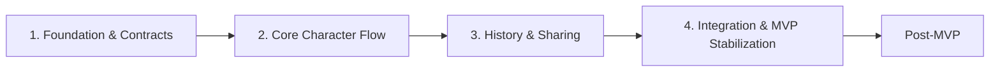

# DiceBound Roadmap

Документ показывает путь DiceBound до MVP и направления развития после MVP.
Он нужен для планирования работ и не заменяет backlog:
конкретные задачи ведутся в [GitHub Project DiceBound][project].

Roadmap опирается на [утверждённый scope MVP](./mvp-scope.md).
При расхождении roadmap и scope MVP верен scope MVP.

> Status: Active

## Этапы

Путь до MVP разделён на четыре этапа.
Каждый этап опирается на результаты предыдущего.

1. Foundation & Contracts
   - Срок: до 03.10.2026.
   - Результат: команды frontend, backend и database работают независимо по
     общим контрактам и дизайну.
   - Шаги пользовательского сценария MVP: нет.
2. Core Character Flow
   - Срок: 04.10.2026 – 01.11.2026.
   - Результат: пользователь создаёт персонажа и редактирует лист,
     построенный из `Sheet Schema`.
   - Шаги пользовательского сценария MVP: 1–9, 18–19.
3. History & Sharing
   - Срок: 02.11.2026 – 22.11.2026.
   - Результат: пользователь работает с историей версий и делится персонажем.
   - Шаги пользовательского сценария MVP: 10–17, 22–27.
4. Integration & MVP Stabilization
   - Срок: 23.11.2026 – середина или конец декабря 2026.
   - Результат: новая НРИ подключается импортом JSON,
     MVP проходит критерии готовности.
   - Шаги пользовательского сценария MVP: 20–21, весь сценарий.

Номера шагов соответствуют разделу «Критерии готовности» в
[scope MVP](./mvp-scope.md#критерии-готовности).

Сроки этапов 2–4 распределены пропорционально их сложности.
Этап 2 получает больше всего времени, потому что закладывает
`Dynamic Sheet Renderer`, валидацию и формулы,
на которые опираются следующие этапы.

## Контрольные точки

- 03.10.2026
  - Контрольная точка: завершение этапа 1.
  - Состояние проекта: контракты и дизайн готовы для параллельной разработки.
- 17.10.2026
  - Контрольная точка: первый смотр приложения.
  - Состояние проекта: идёт этап 2.
- Середина или конец декабря 2026
  - Контрольная точка: финальная сдача MVP.
  - Состояние проекта: этап 4 завершён.

## 1. Foundation & Contracts

Этап фиксирует основу, от которой зависит параллельная разработка.

Состав:

- утверждённый scope MVP как основной источник требований;
- технические контракты `Sheet Schema`, модели данных и API;
- дизайн основных экранов и сценариев, приведённый к MVP;
- UI/UX-документация для frontend-команды.

Этап завершён, когда frontend может реализовывать экраны по контрактам и дизайну
без ожидания готового backend.

## 2. Core Character Flow

Этап реализует основной сценарий работы с персонажем и проверяет schema-driven
подход на двух встроенных системах.

Состав:

- регистрация, вход, выход и защищённые маршруты;
- список персонажей и удаление собственного персонажа;
- встроенные системы D&D 5e и Call of Cthulhu;
- создание персонажа с `CharacterVersion` №1;
- `Dynamic Sheet Renderer` для шести типов полей: `text`, `number`, `select`,
  `checkbox`, `resource`, `calculated`;
- валидация данных по `Sheet Schema`;
- пересчёт `computed fields` через ограниченный expression engine;
- сохранение персонажа.

Этап завершён, когда листы D&D 5e и Call of Cthulhu строятся одним renderer,
а изменение STR с 10 на 16 даёт модификатор `+3`.

## 3. History & Sharing

Этап добавляет локальную историю персонажа и совместный доступ.

Состав:

- история версий и просмотр старой версии в режиме read-only;
- восстановление версии с удалением всех последующих версий;
- вкладка «Доступ» для владельца;
- выдача и отзыв `VIEW` с настройкой видимости истории;
- выдача `EDIT` с созданием независимой копии персонажа.

Этап завершён, когда получатель `VIEW` не может изменить персонажа,
а изменения `EDIT`-копии не меняют оригинал.

## 4. Integration & MVP Stabilization

Этап проверяет основную гипотезу MVP и доводит продукт до критериев готовности.

Состав:

- импорт игровой системы из JSON-схемы на `/systems/import`;
- управление игровыми системами на `/systems`;
- интеграция frontend, backend и database на полном пользовательском сценарии;
- системные состояния: загрузка, 404 и 403, ошибка сохранения, истёкшая сессия;
- адаптивное поведение интерфейса для desktop, планшета и телефона;
- исправление ошибок, найденных при прохождении сценария.

Этап завершён, когда выполняются пользовательский сценарий и технический
acceptance test из
[критериев готовности MVP](./mvp-scope.md#критерии-готовности).

> **Важно:** третья игровая система подключается новой JSON-схемой без изменения
> `Dynamic Sheet Renderer` и основного backend-кода `Character`.

## Post-MVP

Направления развития после MVP не входят в текущий scope.
Их состав и порядок уточняются после завершения MVP.

- Визуальный Schema Editor
  - Содержание: создание и изменение `Sheet Schema` в интерфейсе вместо ручного
    JSON.
  - Связь с MVP: в MVP схема добавляется только импортом JSON.
- Versioning и migration `Sheet Schema`
  - Содержание: несколько версий одной схемы и перенос персонажей между ними.
  - Связь с MVP: в MVP персонаж ссылается на конкретный `sheet_schema_id`,
    migration engine не реализуется.
- Visual diff версий персонажа
  - Содержание: наглядное сравнение двух `CharacterVersion`.
  - Связь с MVP: в MVP история показывает номер и дату версии без diff.
- Campaigns, groups и расширенный sharing
  - Содержание: кампании, группы, роли кампании, публичные ссылки,
    приглашение незарегистрированных пользователей.
  - Связь с MVP: в MVP доступ выдаётся по email зарегистрированного пользователя
    с уровнями `VIEW` и `EDIT`.

Полный список исключений приведён в разделе «Не входит в MVP»
[scope MVP](./mvp-scope.md#не-входит-в-mvp).

## Связанные документы

- [DiceBound MVP](./mvp-scope.md) — scope продукта и критерии готовности.
- [UI/UX-документация DiceBound](./ui-ux.md) — экраны,
  визуальный язык и правила UI.
- [Холст дизайна DiceBound MVP][figma] — актуальные макеты.
- [Технические контракты](./technical-contracts.md) — `Sheet Schema`,
  модель данных и API.

[figma]: https://www.figma.com/design/x7TCZBlTPGuzM1MxrPfq4g/DiceBound-Design
[project]: https://github.com/orgs/Smert-Interactive/projects/1
