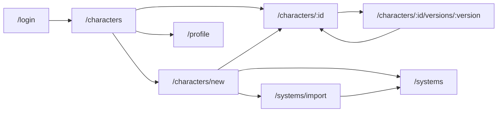

# UI/UX DiceBound

Документ описывает визуальное направление, принципы и правила интерфейса
DiceBound MVP.
Он нужен frontend-команде, чтобы реализовать интерфейс по утверждённому дизайну
и понимать, почему экраны устроены именно так.
Scope продукта и поведение функций описаны в документе
[DiceBound MVP](./mvp-scope.md), здесь зафиксированы только решения интерфейса.

> Status: Active

## Источник дизайна

Актуальные макеты находятся на холсте [DiceBound — MVP дизайн][figma].
При расхождении этого документа и холста верен холст.
Расхождение дизайна с [DiceBound MVP](./mvp-scope.md) исправляется в дизайне.

Доски на холсте сгруппированы по рядам.

- Вход и список персонажей — `Main`, `Characters`, `CharactersEmpty`,
  `DeleteConfirm`.
- Создание персонажа и динамический лист — `Create`, `SheetDnD`, `SheetCoC`.
- История версий и восстановление — `History`, `Version`, `RestoreConfirm`.
- Доступ VIEW / EDIT — `Access`, `ShareAdd`, `SheetView`.
- Импорт НРИ и профиль — `Import`, `ImportError`, `Profile`, `Systems`.
- EDIT-копия, renderer и системные состояния — `SheetCopy`, `FieldKit`,
  `States`.
- Адаптивность — `Responsive`, `MCharacters`, `MSheetDnD`, `MAccess`, `MImport`.

## Принципы UI/UX

**Лист не рисуется под НРИ.**
Любой лист собирает один компонент `Dynamic Sheet Renderer` из `Sheet Schema` и
данных персонажа.
D&D 5e, Call of Cthulhu и импортированная Custom System на холсте построены из
одних и тех же шести типов полей.

**Один renderer для всех режимов.**
Редактирование, просмотр старой версии, лист получателя `VIEW` и предпросмотр
импорта используют тот же renderer.
Режим read-only включается флагом, а не отдельным компонентом.

**Необратимое действие называет последствие.**
Восстановление версии, выдача `EDIT`, удаление персонажа и удаление системы
требуют подтверждения.
Кнопка подтверждения описывает результат, например
«Восстановить и удалить 3 версии», а не «ОК».

**Вычисляемое видно сразу.**
Фиолетовый цвет используется только для `calculated`-полей и связанных с ними
элементов.
Пользователь отличает вычисляемое значение от редактируемого без чтения
подписей.

**Интерфейс не раскрывает чужие данные.**
Ошибки выдачи доступа, 404 и 403 не сообщают,
существует ли аккаунт или чужой персонаж.

**В интерфейсе нет функций вне MVP.**
Функции, исключённые из MVP, не появляются на макетах даже как заглушка «скоро».

## Визуальное направление

Интерфейс использует тёмную тему со спокойной «настольной» атмосферой.
Crimson — акцент действий.
Фиолетовый — единственный маркер вычисляемых значений.
Зелёный обозначает успешное состояние.

### Цвета

| Цвет | Применение |
| --- | --- |
| `#0b0b0f` | Фон вокруг приложения |
| `#0e0e12` | Основной фон приложения |
| `#121218` | Боковая навигация |
| `#17171f` | Карточки секций, модальные окна |
| `#15151c` | Read-only поля, пары «характеристика + модификатор» |
| `#1e1e28` | Поля ввода, обычные кнопки, чипы |
| `#282836` | Hover кнопок |
| `#101016` | Редактор JSON |
| `#2a2a37` | Границы карточек |
| `#3b3b4e` | Границы полей и кнопок |
| `#23232e` | Разделители строк таблиц |
| `#ece8e2` | Основной текст |
| `#b9b6c2` | Второстепенный текст, навигация |
| `#8b8899` | Подписи полей, метаданные |
| `#6f6c7e` | Диапазоны `min–max` внутри полей |
| `#d8d4de` | Значения в read-only полях |
| `#c93450` → `#b02a40` | Primary-кнопки, вертикальный градиент |
| `#c93450` → `#b02a40` | Активная вкладка, отмеченный checkbox |
| `#ea6a7e` | Ошибки, изменённые поля, полоса HP |
| `#9a8fe6` | Иконка и рамка `calculated`, обводка фокуса |
| `#b3aaf0`, `#c9c2f7` | Текст `calculated`-значений, чип Custom System |
| `#6dbf95`, `#8fd4b0` | «Все изменения сохранены», «Схема корректна» |
| `#6dbf95`, `#8fd4b0` | Метка CoC |

Подложки чипов и баннеров строятся от акцентного цвета.
Фон подложки имеет 9–16 % непрозрачности, граница — 34–45 %.

Метка игровой системы — квадрат с моноширинной аббревиатурой.
Размер метки — 38 px, в шапке листа — 52 px.
D&D 5e использует crimson, Call of Cthulhu (`CoC`) — зелёный,
импортированные системы (`CS`, `SF`) — фиолетовый.

### Подсветка JSON

Редактор JSON на экране импорта подсвечивает синтаксис.

| Элемент | Цвет |
| --- | --- |
| Ключи | `#9dbbe8` |
| Строки | `#8fd4b0` |
| Числа и `true` / `false` / `null` | `#e6c07b` |
| Пунктуация | `#6f6c7e` |
| Формулы | цвет `calculated`-полей |

Слева от кода выводятся номера строк.
При ошибках проверки строки с ошибками подсвечены.

## Типографика

- Интерфейс
  - Шрифт: Geist 400/500/600.
  - Параметры: базовый 14 px / 1.5, навигация 13.5 px.
- Подписи полей, метаданные, числа, формулы, чипы, хлебные крошки
  - Шрифт: Geist Mono 400/500.
  - Параметры: 11–13 px.
- Имя персонажа, крупные заголовки
  - Шрифт: Cormorant Garamond 600.
  - Параметры: 30 px в шапке листа, 40 px на справочных досках.
- Заголовок страницы
  - Шрифт: Geist 600.
  - Параметры: 24 px.

Числовые значения характеристик и ресурсов, номера версий и формулы всегда
набираются Geist Mono.
Модификаторы показываются со знаком: `+3`, `−1`, `+0`.
Для отрицательных значений используется типографский минус `−`.

## Layout

### Каркас приложения

Рабочая ширина макетов — 1280 px.

- Боковая панель
  - Размер: 224 px.
  - Содержимое: логотип, «Персонажи», «Импорт системы», «Профиль».
- Верхняя панель
  - Размер: 56 px.
  - Содержимое: хлебные крошки моноширинным шрифтом,
    справа кнопка аккаунта с почтой.
- Контент
  - Размер: отступы 28 px сверху, 36 px по бокам.
  - Содержимое: вертикальный шаг блоков 22 px.
- Панель сохранения на листе
  - Размер: 68 px.
  - Содержимое: закреплена внизу контентной области.

### Размеры и скругления

| Элемент | Высота | Скругление |
| --- | --- | --- |
| Поле ввода, `select`, строка `checkbox` | 40 px | 9 px |
| Кнопка | 38 px | 10 px |
| Малая кнопка, в том числе − / + у счётчиков | 32 px | 8 px |
| Карточка секции | — | 14 px, отступ 18 px |
| Модальное окно | ширина 460 px | 18 px, отступ 24 px |
| Чип | — | полностью скруглён |

### Страница персонажа

Шапка содержит метку системы, имя персонажа, систему, название листа,
дату изменения и номер версии.
Под шапкой расположены вкладки «Лист | История | Доступ».
Под вкладками идут карточки секций листа.
Панель сохранения закреплена внизу контентной области.

## Навигация и пользовательские сценарии

Боковая панель содержит три пункта: «Персонажи», «Импорт системы», «Профиль».
Страница `/systems` не имеет отдельного пункта.
На ней активен пункт «Импорт системы».
Страница открывается ссылкой «Управлять системами» на шаге 1 создания персонажа
и ссылкой «Мои игровые системы» на экране импорта.

Страница `/characters/:id` содержит вкладки «Лист», «История» и «Доступ».
Набор вкладок зависит от роли пользователя, см. раздел
[Editable и read-only состояния](#editable-и-read-only-состояния).

### Экраны

- `/login`
  - Доски: `Main`.
  - Ключевые решения интерфейса: вкладки «Вход / Регистрация». Ошибка
    «Неверная почта или пароль» выводится над кнопкой, поля не очищаются.
- `/characters`
  - Доски: `Characters`, `CharactersEmpty`, `DeleteConfirm`.
  - Ключевые решения интерфейса: блоки «Мои персонажи» и «Доступные мне».
    Колонки: имя, система, дата изменения, «Открыть»,
    удаление. Пустое состояние содержит одну кнопку «Создать персонажа».
- `/characters/new`
  - Доски: `Create`.
  - Ключевые решения интерфейса: три шага на одном экране —
    система → лист (`Sheet Schema`) → имя. Справа сводка выбора.
- `/characters/:id`
  - Доски: `SheetDnD`, `SheetCoC`, `SheetCopy`, `SheetView`, `History`,
    `Access`.
  - Ключевые решения интерфейса: Лист, история и доступ во вкладках одной
    страницы.
- `/characters/:id/versions/:version`
  - Доски: `Version`, `RestoreConfirm`.
  - Ключевые решения интерфейса: снимок версии в read-only и восстановление.
- `/systems/import`
  - Доски: `Import`, `ImportError`.
  - Ключевые решения интерфейса: редактор JSON и предпросмотр листа рядом.
- `/systems`
  - Доски: `Systems`.
  - Ключевые решения интерфейса: список систем, удаление импортированных.
- `/profile`
  - Доски: `Profile`.
  - Ключевые решения интерфейса: почта, дата создания аккаунта,
    счётчики «Мои персонажи» и «Доступные мне», «Выйти».

### Список персонажей

Персонажи с доступом `VIEW` отличаются от собственных тремя признаками:
иконкой глаза, чипом `VIEW` и пунктирной рамкой.
Под именем такого персонажа выводится «Владелец: …».
Копия, полученная через `EDIT`, выглядит как обычный собственный персонаж с
подписью «Копия от … · редактируется независимо».
Кнопка удаления есть только у собственных персонажей.

Подтверждение удаления перечисляет, что будет удалено: лист,
все версии истории и выданные доступы.
Оно также сообщает, что `EDIT`-копии у других пользователей останутся.

### Создание персонажа

Шаг 1 содержит ссылки «Управлять системами» и «Импортировать из JSON».
Импортированные системы подписаны «Импортирована».
Поля нового листа заполняются значениями по умолчанию из схемы.
После создания пользователь сразу попадает на лист,
состояние сохранено как версия 1.

## Компоненты

### Кнопки

| Вариант | Применение |
| --- | --- |
| primary | Главное действие экрана, crimson-градиент |
| default | Обычное действие |
| ghost | Второстепенное действие |
| danger | Удаление и отзыв доступа |

Каждая кнопка содержит текст, иконка слева необязательна.
Кнопка-иконка получает `aria-label`, например `Удалить Aldric`.

### Чипы

Чип — небольшая скруглённая метка с коротким текстом,
например название системы или уровень доступа.
Чип не является кнопкой и не выполняет действий.

| Вариант | Применение |
| --- | --- |
| нейтральный | Метаданные |
| crimson | Система D&D, доступ `EDIT` |
| violet | Custom System, доступ `VIEW` |
| ok | Успешный статус |

### Вкладки

Активная вкладка подчёркнута crimson.

### Баннеры

| Цвет | Применение |
| --- | --- |
| Фиолетовый | Информация: копия, режим только просмотра |
| Crimson | Предупреждения, например о необратимости `EDIT` |
| Зелёный | Успешная проверка схемы |

### Модальные окна

Затемнение фона — `rgba(9,9,12,.74)`.
Ширина окна — 460 px.
Кнопка подтверждения называет последствие действия.

### Иконки

Иконки выполняются только inline SVG со stroke 1.8 и скруглёнными концами.
Emoji не используются.

## Dynamic Character Sheet

`Dynamic Sheet Renderer` выбирает компонент поля по `field.type`,
а не по игровой системе.
Интерфейс не содержит ветвлений вида «если D&D — показать такой-то лист».
Импорт схемы не может добавить новый тип поля.
Справочник компонентов находится на доске `FieldKit`.

### Секции и сетка

`section` — не поле, а карточка с заголовком `title`.
`fields` — массив описаний полей внутри секции в `Sheet Schema`.
Renderer выводит поля строго в порядке этого массива,
заполняя сетку в 4 колонки слева направо и сверху вниз.
`resource` занимает 2 колонки.
Характеристика и связанное `calculated`-поле показываются парой
«значение | модификатор», пары на desktop располагаются в 3 колонки.

### Типы полей

- `text`
  - Редактирование: поле ввода.
  - Ошибка валидации: правил в схеме MVP нет.
  - Read-only: плашка со значением.
- `number`
  - Редактирование: поле Geist Mono, диапазон `min–max` серым внутри поля
    справа. На листах — счётчик с кнопками − / +.
  - Ошибка валидации: «Допустимо от {min} до {max}».
  - Read-only: плашка, моноширинный шрифт.
- `select`
  - Редактирование: выпадающий список из `options`.
  - Ошибка валидации: «Значение не из списка options».
  - Read-only: плашка со значением.
- `checkbox`
  - Редактирование: строка с квадратом 18 px и подписью, отмеченный квадрат —
    crimson.
  - Ошибка валидации: не бывает.
  - Read-only: строка с серым квадратом.
- `resource`
  - Редактирование: два поля «текущее / макс.» и полоса заполнения.
  - Ошибка валидации: «Нужно число в current и max».
  - Read-only: «21 / 28» и приглушённая полоса.
- `calculated`
  - Редактирование: не редактируется — пунктирная фиолетовая рамка, значение,
    формула мелким шрифтом, иконка ƒ у подписи.
  - Ошибка валидации: значение «—» и «Зависит от STR: исправьте значение».
  - Read-only: то же значение, взятое из snapshot.

### Поведение листа

`calculated`-поля пересчитываются на клиенте сразу при изменении зависимого
значения.
Формулы исполняет ограниченный expression engine, `eval()` запрещён.
Список допустимых операций и функций приведён в разделе
«Dynamic Character Sheet» документа
[DiceBound MVP](./mvp-scope.md#dynamic-character-sheet).

Поле, значение которого изменено после последнего сохранения,
получает рамку цвета `#ea6a7e`.
Для характеристики со связанным `calculated`-полем рамку получает вся пара.
Невалидное значение блокирует «Сохранить».
«Отменить изменения» возвращает последнее сохранённое состояние.
Версия создаётся только по нажатию «Сохранить».

### Панель сохранения

| Состояние | Текст |
| --- | --- |
| Без изменений | «Все изменения сохранены · версия N» |
| Изменения | «Несохранённых изменений: K — сохранение создаст версию N+1» |
| Сразу после сохранения | «Сохранено · создана версия N» |
| Есть ошибки | «Исправьте ошибки, чтобы сохранить» |
| Ошибка сохранения | «Не удалось сохранить» и кнопка «Повторить» |

На `EDIT`-копии к тексту добавляется «копии», после сохранения —
«оригинал не изменён».
Кнопка сохранения на копии называется «Сохранить копию».

## Editable и read-only состояния

Режим листа определяется ролью пользователя и открытой страницей.

- Лист владельца
  - Доска: `SheetDnD`, `SheetCoC`.
  - Поля: редактируемые.
  - Вкладки: Лист, История, Доступ.
  - Особенности: панель сохранения.
- `EDIT`-копия
  - Доска: `SheetCopy`.
  - Поля: редактируемые.
  - Вкладки: Лист, История, Доступ.
  - Особенности: баннер о происхождении копии, своя история с v1.
- Историческая версия
  - Доска: `Version`.
  - Поля: Read-only.
  - Вкладки: нет.
  - Особенности: баннер «Только просмотр. Текущая версия персонажа — N»,
    кнопки «К истории» и «Восстановить эту версию».
- Получатель `VIEW`
  - Доска: `SheetView`.
  - Поля: Read-only.
  - Вкладки: Лист; История, если владелец открыл её.
  - Особенности: баннер «Только просмотр» сообщает, открыта ли история.
- Предпросмотр импорта
  - Доска: `Import`.
  - Поля: по схеме.
  - Вкладки: нет.
  - Особенности: скрыт до успешной проверки схемы.

В read-only режиме поля выводятся плашками с фоном `#15151c` и значением цвета
`#d8d4de`.
Панели сохранения в read-only режиме нет.

## История версий

Вкладка «История» показывает версии от новых к старым.
Каждая строка содержит номер версии, дату в формате `ДД.ММ.ГГГГ ЧЧ:ММ`,
«Открыть» и «Восстановить».
Версия 1 подписана «создание персонажа».
Текущая версия помечена и не имеет «Восстановить».
Справа от списка расположен блок «Как работает история».
Авторов изменений и diff в интерфейсе нет.

Историческая версия открывается на отдельном маршруте через тот же renderer в
read-only.

### Восстановление

Подтверждение восстановления показывает таймлайн v1…vN.
Выбранная версия отмечена как будущая текущая,
последующие версии показаны перечёркнутыми.
Окно сообщает, что действие необратимо.
Кнопка называет число удаляемых версий.

## Sharing и доступ

Вкладку «Доступ» видит только владелец персонажа,
в том числе владелец `EDIT`-копии.
Правила уровней `VIEW` и `EDIT` описаны в
[требованиях к Sharing](./mvp-scope.md#sharing).

### Таблица доступа

Таблица содержит колонки «Почта — Доступ — История версий — Действие».
Рядом расположена справка по `VIEW` и `EDIT`.

| Строка | Колонка «История версий» | Колонка «Действие» |
| --- | --- | --- |
| `VIEW` | «Открыта» или «Скрыта» | «Отозвать доступ» с подтверждением |
| `EDIT` | «Своя у копии, с v1» | «Копия передана окончательно» |

Строка `EDIT` показывает «Копия передана {дата}».
Кнопки изменения доступа нет: тип доступа и видимость истории задаются только
при выдаче.

### Выдача доступа

Модальное окно содержит поле почты и выбор `VIEW` / `EDIT`.

- `VIEW`
  - Дополнительный элемент: флажок «Показывать историю версий»,
    по умолчанию выключен.
  - Текст кнопки: «Выдать доступ VIEW».
- `EDIT`
  - Дополнительный элемент: Crimson-баннер о необратимости.
  - Текст кнопки: «Создать копию и выдать EDIT».

Для почты без аккаунта показывается нейтральная ошибка
«Не удалось выдать доступ по этой почте».
Повторная выдача уже имеющему доступ пользователю даёт ошибку.
Для `VIEW` ошибка объясняет, что сначала нужно отозвать доступ, для `EDIT` —
что копия уже передана.

## Импорт и игровые системы

### Импорт

Экран импорта содержит название системы, название листа и редактор JSON-схемы.
Схему можно вставить текстом или загрузить `.json`-файлом.
Под редактором выводится статус синтаксиса: «JSON корректен · N строк» или
«Ошибка синтаксиса JSON · строка N».
Кнопка «Проверить схему» запускает проверку, «Импортировать систему» — импорт.

Ошибки проверки выводятся списком.
Каждая ошибка содержит JSON-путь и номер строки с ошибкой.

- `sections[0].fields[1].type` — неизвестный тип «slider». Допустимо: text,
  number, select, checkbox, resource, calculated.
- `sections[1].fields[1].formula` — функция «pow» не поддерживается. Допустимо:
  floor, ceil, round, min, max.
- `sections[1].fields[1].formula` — поле «agility» не найдено в схеме.

Для корректной схемы показываются сводка «N секции · N полей · N формула» и
предпросмотр листа.

### Игровые системы

Страница `/systems` содержит колонки «Источник» и «Персонажи на системе».
«Источник» показывает «встроенная» или «импортирована вами» с датой импорта.
«Персонажи на системе» показывает число персонажей или «Не используется».
Кнопка удаления есть только у импортированных систем.
Текст подтверждения различается для системы с персонажами и без них.
После удаления показывается уведомление «Система «{название}» удалена из списка
игровых систем».

## Системные состояния

Каждый экран с данными обрабатывает четыре состояния,
они показаны на доске `States`.

- Загрузка — скелет повторяет сетку секций, а не конкретную систему:
  до ответа схемы число полей неизвестно.
- 404 и 403 — один текст «Персонаж не найден или доступ закрыт»,
  пояснение «Владелец мог удалить персонажа или отозвать ваш доступ VIEW» и
  кнопка «К списку персонажей».
- Ошибка сохранения (сеть или 5xx) — панель сохранения показывает
  «Не удалось сохранить», изменения остаются на листе, версия не создаётся,
  есть кнопка «Повторить».
- Истёкшая сессия (401) — модальное окно «Сессия завершилась» ведёт на `/login`,
  после входа пользователь возвращается на ту же страницу.

Серверные ошибки валидации показываются у полей так же, как клиентские.
Сетевые ошибки показываются в панели сохранения.

## Адаптивность

Основной макет — desktop шириной 1280 px.
На меньшей ширине интерфейс перестраивается, а не сжимается пропорционально.
Правила заданы для типов блоков и типов полей,
поэтому любой лист перестраивается одинаково для любой игровой системы.

- Desktop, ≥ 1024 px — все доски холста, 1280 px.
- Планшет, 640–1023 px — отдельных макетов нет, строится по правилам.
- Телефон, < 640 px — `MCharacters`, `MSheetDnD`, `MAccess`, `MImport`, 390 px.

Минимальная поддерживаемая ширина — 360 px.
Остальные экраны на телефоне собираются по тем же правилам без отдельных
макетов.

### Правила перестройки

- Навигация
  - Desktop: боковая панель 224 px.
  - Планшет: боковая панель 64 px, только иконки с подсказками.
  - Телефон: верхняя панель 56 px — меню, логотип, аккаунт. Разделы —
    в выдвижной панели слева.
- Хлебные крошки
  - Desktop: в верхней панели.
  - Планшет: в верхней панели.
  - Телефон: скрыты, на вложенных экранах вместо них кнопка «назад».
- Отступы контента
  - Desktop: 28 px сверху, 36 px по бокам.
  - Планшет: 24 px.
  - Телефон: 16 px.
- Сетка полей листа
  - Desktop: 4 колонки.
  - Планшет: 2 колонки.
  - Телефон: 2 колонки; `text`, `select` и `resource` занимают всю ширину.
- Характеристика + `calculated`
  - Desktop: пары в 3 колонки.
  - Планшет: пары в 2 колонки.
  - Телефон: каждая пара — строка на всю ширину: подпись, счётчик, модификатор,
    формула под строкой.
- Таблицы
  - Desktop: таблица.
  - Планшет: таблица без второстепенных колонок.
  - Телефон: карточки; одна строка — одна карточка, действия внизу карточки.
- Вкладки персонажа
  - Desktop: под шапкой.
  - Планшет: под шапкой.
  - Телефон: под шапкой, при нехватке места прокручиваются по горизонтали.
- Импорт системы
  - Desktop: редактор и предпросмотр рядом.
  - Планшет: предпросмотр под редактором.
  - Телефон: одна колонка, редактор высотой 360 px с горизонтальной прокруткой.
- Модальные окна
  - Desktop: 460 px по центру.
  - Планшет: 460 px по центру.
  - Телефон: Лист снизу на всю ширину, кнопки друг под другом, главная — сверху.
- Панель сохранения
  - Desktop: внизу контента, одна строка.
  - Планшет: внизу контента, одна строка.
  - Телефон: закреплена внизу экрана — статус строкой выше, кнопки строкой ниже.
- Типографика
  - Desktop: имя 30 px, заголовок 24 px.
  - Планшет: как на desktop.
  - Телефон: имя 26 px, заголовок 20 px.

Перестройка меняет только число колонок и ширину полей.
Порядок полей всегда берётся из массива `fields`.

## Доступность

Интерактивные элементы реализуются настоящими `<button>`, `<a>`,
`<input>` и `<select>` с `<label>`.
Фокус обозначается обводкой 2 px `#9a8fe6` со смещением 2 px.
Ошибка поля связывается с ним через `aria-invalid` и `aria-describedby`.

Цвет не является единственным носителем смысла.
Изменённое поле помечается рамкой и счётчиком в панели сохранения.
`VIEW`-персонажи отличаются иконкой глаза, чипом и пунктирной рамкой.

## Тексты интерфейса

Язык интерфейса — русский.
Названия систем и характеристик (STR, DEX, HP, AC, Sanity,
Spot Hidden) остаются как в схеме.
Формат даты — `24.09.2026 18:42`.
Кнопки называют действие или его последствие.

## Решения для frontend-реализации

1. Лист строится только через `Dynamic Sheet Renderer`,
   компонент поля выбирается по `field.type`.
2. Read-only режим — флаг renderer, отдельных компонентов для истории,
   `VIEW` и предпросмотра импорта нет.
3. Цвета, размеры и скругления берутся из разделов
   [Визуальное направление](#визуальное-направление) и [Layout](#layout).
4. Числа, номера версий и формулы набираются Geist Mono,
   отрицательные модификаторы — с типографским минусом.
5. `calculated`-поля пересчитываются на клиенте без `eval()`.
6. Версия создаётся только по кнопке «Сохранить».
7. Невалидное значение блокирует сохранение, серверные ошибки валидации
   выводятся у полей.
8. Скелет загрузки строится по сетке секций, а не по конкретной системе.
9. Ошибки доступа, 404 и 403 не раскрывают существование аккаунта или чужого
   персонажа.
10. Защищённые маршруты проверяют сессию через `GET /auth/me` и передают адрес
    страницы на `/login`.
11. Адаптивность реализуется по правилам для типов блоков и полей,
    без макетов под конкретную систему.

## Ограничения

> **Ограничение:** интерфейс MVP не содержит OAuth и соцвход,
> подтверждение почты, восстановление пароля, visual diff версий,
> авторов изменений, кампании, группы, роли, чат, realtime-редактирование,
> Schema Editor, визуальный конструктор систем, drag-and-drop раскладку листа,
> публичные и анонимные ссылки, приглашение незарегистрированных, аватарки,
> загрузку файлов кроме `.json`-схемы и отдельные подсистемы инвентаря и
> заклинаний.

> **Примечание:** адаптивная веб-версия не является мобильным приложением и
> входит в MVP.

## Связанные документы

- [DiceBound MVP](./mvp-scope.md) — scope продукта и поведение функций.
- [Холст DiceBound — MVP дизайн][figma] — актуальные макеты.
- [Технические контракты](./technical-contracts.md) — `Sheet Schema`,
  модель данных и API.

[figma]: https://www.figma.com/design/x7TCZBlTPGuzM1MxrPfq4g/DiceBound-Design
